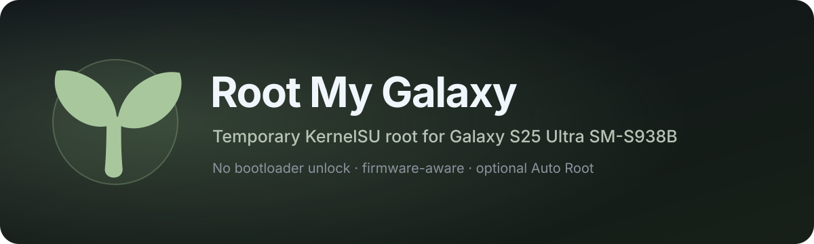

<p align="center">
  
</p>

<p align="center">
  <a href="https://github.com/igorcv88/Root-My-Galaxy-S938B/releases/latest"></a>
  <a href="https://github.com/igorcv88/Root-My-Galaxy-S938B/releases"></a>
  <a href="https://github.com/igorcv88/Root-My-Galaxy-S938B/stargazers"></a>
  
  
  <a href="https://github.com/igorcv88/Root-My-Galaxy-S938B/actions/workflows/release.yml"></a>
  <a href="LICENSE"></a>
</p>

<p align="center">
  <strong>Temporary KernelSU root for supported Samsung Galaxy firmware without unlocking the bootloader or flashing a modified boot image.</strong>
</p>

<p align="center">
  <a href="https://github.com/igorcv88/Root-My-Galaxy-Payloads-S938B">Payloads</a>
  ·
  <a href="https://github.com/BuSung-dev/Root-My-Galaxy">Upstream</a>
  ·
  <a href="https://github.com/igorcv88/Root-My-Galaxy-S938B/releases/latest">Latest release</a>
</p>

Root My Galaxy checks the phone and firmware, downloads the matching payload, runs the kernel exploit, and late-loads KernelSU. Root remains active for the current kernel boot. A full reboot returns the phone to the stock kernel state; the optional **Auto Root** feature can restore KernelSU after Android starts again.

> [!WARNING]
> This software uses a kernel exploit. The exploit is timing-sensitive, may take several minutes, can make the phone temporarily unresponsive or warm, and can cause a kernel panic/reboot on a failed attempt. Use it only on a device you own or are explicitly authorized to test.

## Why this fork?

This repository is derived from [BuSung-dev/Root-My-Galaxy](https://github.com/BuSung-dev/Root-My-Galaxy), but it is not just a mirror. The main additions in this fork are:

- **Auto Root after a full reboot** — once a compatible payload has completed a successful manual KernelSU installation, the app can restore root after the next full kernel boot.
- **Last-known-good Auto Root snapshots** — new payload downloads are staged separately. A payload becomes the Auto Root snapshot only after a manual installation has actually completed successfully. Later repository or APK updates do not invalidate that working local snapshot.
- **Stricter CZG3 validation** — the maintained `SM-S938B / S938BXXSBCZG3` profile uses exact device, firmware, kernel and runtime identity checks plus SHA-256 verification for the exploit and KernelSU payload.
- **Fail-closed boot-time behavior** — Auto Root does not download a newly published exploit during boot and does not silently substitute a different payload. If its last verified local snapshot is missing, modified or incompatible with the current firmware, it stops.
- **Integrated signed release pipeline** — release builds validate the current CZG3 payload metadata, run tests and lint, sign and verify the APK, publish a checksum, and generate release notes.

Shizuku support, Advanced mode, installation history and much of the base UI originate from upstream and are therefore not fork-exclusive features.

## Compatibility

The **application architecture is not inherently limited to the Galaxy S25 Ultra**. Upstream Root My Galaxy maintains a broader device catalog.

The current controlled v3 feed in this fork is narrower: its automatic profile is presently the exact CZG3 configuration below. That restriction was introduced in this fork after the upstream synchronization to make the CZG3 path fail closed; it is a feed policy, not a fundamental limitation of the Android app.

| | Current controlled profile |
| --- | --- |
| Device | Samsung Galaxy S25 Ultra `SM-S938B` (`pa3q`) |
| Firmware | `S938BXXSBCZG3` |
| Android | Android 16 / API 36 |
| Kernel | `6.6.98-android15-8-pd6ff1cd-abogkiS938BXXSBCZG3-4k` |
| ABI | `arm64-v8a` |
| Page size | 4K |

The release and Auto Root architecture has been separated so the remote catalog can contain multiple profiles while the embedded migration fallback remains a single exact CZG3 profile. Broader profiles should only be re-exposed after their delivery and integrity rules are validated independently, without weakening the working CZG3 path.

Firmware updates can change the kernel and invalidate an exploit profile. The app stops rather than silently treating a mismatched exact profile as compatible.

## Installation

1. Download the latest signed APK from [GitHub Releases](https://github.com/igorcv88/Root-My-Galaxy-S938B/releases/latest).
2. Install and open **Root My Galaxy**.
3. Check the device and firmware information shown on the Home screen.
4. Optional: open **Settings → Use Shizuku** if Shizuku is already installed and running.
5. Tap the installation card and confirm **Install KernelSU**.
6. Keep the installer screen open while it runs. The exploit stage can finish quickly or take several minutes.
7. When **KernelSU active** appears, install or open KernelSU Manager from the app.
8. Optional: enable **Automatic root after reboot** on the successful-install screen.

Official APKs are distributed through this repository. Releases also include a `.sha256` file for checksum verification.

## What happens during installation

The app shows the complete process in four stages:

1. **Support check** — reads device, firmware and kernel information and selects the matching support profile.
2. **Download** — downloads the exploit and KernelSU payload for that profile and verifies their expected metadata.
3. **Kernel exploit** — runs the exploit until temporary bootstrap root is acquired or the attempt fails/times out.
4. **Load KernelSU** — stages the KernelSU payload, late-loads the kernel module and verifies the KernelSU control channel before reporting success.

The app does not unlock the bootloader, flash `boot`, replace the Samsung kernel, or make the kernel modification persistent across a full reboot.

## Auto Root

**Automatic root after reboot** becomes available after a successful manual KernelSU installation.

The current Auto Root storage model is intentionally transactional:

```text
manual install downloads payloads
        ↓
payloads stay in a pending area
        ↓
exploit succeeds
        ↓
KernelSU late-load is verified
        ↓
that exact payload set becomes known-good
        ↓
next full boot promotes/uses the verified local snapshot
        ↓
Auto Root runs without downloading a replacement payload
```

This means publishing a newer payload does **not** break Auto Root for a user who already has a working snapshot. The existing known-good files and their matching profile remain local until another manual installation successfully proves a newer set.

For users upgrading from an older app version that predates durable snapshots, the APK still contains a single exact CZG3 profile as a migration fallback. After the next successful manual installation, the local snapshot becomes authoritative and future APK/feed changes no longer need to match that stored payload byte-for-byte.

Auto Root attempts restoration at most once for each full kernel boot. A foreground notification shows its stage and includes an action to disable Auto Root. Notification permission is required when the feature is enabled.

If Shizuku is already running and Root My Galaxy already has permission when Auto Root starts, it may be used. Auto Root does not stop at boot to request or start Shizuku.

## Shizuku

Shizuku is optional. Root My Galaxy can run without it.

When **Use Shizuku** is enabled, the app uses the Shizuku shell context for payload execution and staging. Shizuku must already be running and Root My Galaxy must have permission to use it.

If Shizuku is unavailable, either start it from the Shizuku app and grant permission or disable **Use Shizuku** to use the standalone path.

## Advanced mode

**Advanced mode** changes installation from automatic profile selection to a manual payload picker. The picker shows device and kernel compatibility and warns before continuing with a mismatch.

Use manual selection only when you deliberately want to test a specific support profile. A payload intended for another device, kernel or firmware can crash the device.

## History and logs

The **History** tab keeps each installation run with its result, time, selected payload, whether Shizuku was used, and the captured log.

Open a run to inspect the full log. Use **Export log** to save it as a text file when troubleshooting or reporting a reproducible problem. Old entries can be selected and deleted from the History screen.

## App updates

Root My Galaxy checks this repository for newer releases. When an update is available, it can download the new signed APK and open the Android installer directly from the app. You can also check manually from **Settings → Check for updates**.

## Common problems

**Support check failed:** the phone, firmware or kernel does not match a maintained automatic profile. Do not force another profile unless you know it is compatible.

**The exploit is taking a long time:** the acquisition step is timing-sensitive. Keep the installer open. The app monitors progress and stops attempts that stall or exceed its overall time limit.

**The phone rebooted during the exploit:** a kernel panic can occur on an unsuccessful run. After Android boots normally, open Root My Galaxy and try again. The stock kernel is used after a full reboot.

**Auto Root failed after reboot:** Auto Root performs one automatic run for that boot. Open the app, check the run result/log, and perform a manual installation if needed.

**Shizuku is not running:** start Shizuku and grant Root My Galaxy permission, or turn off the Shizuku option.

## KernelSU and modules

Root My Galaxy installs **KernelSU** through late-load. KernelSU Manager is used to grant root access to apps and manage KernelSU modules after root is active.

Root My Galaxy does not install Magisk or APatch and does not manage Zygisk, LSPosed or other KernelSU modules itself.

## License and credits

This project is distributed under the license in [LICENSE](LICENSE). It is derived from [BuSung-dev/Root-My-Galaxy](https://github.com/BuSung-dev/Root-My-Galaxy) and uses [KernelSU](https://github.com/tiann/KernelSU) for kernel-based root management.
